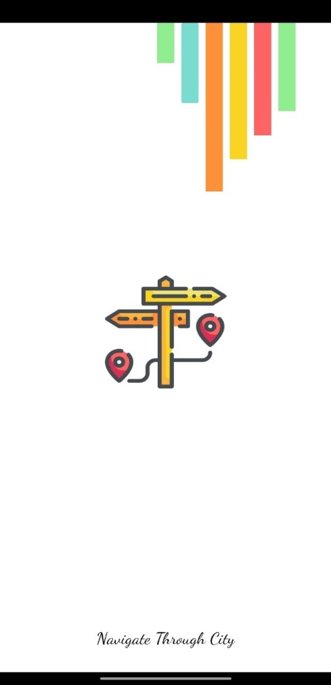
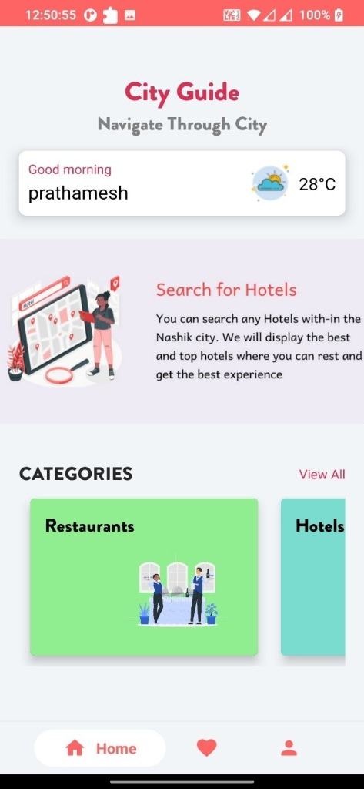
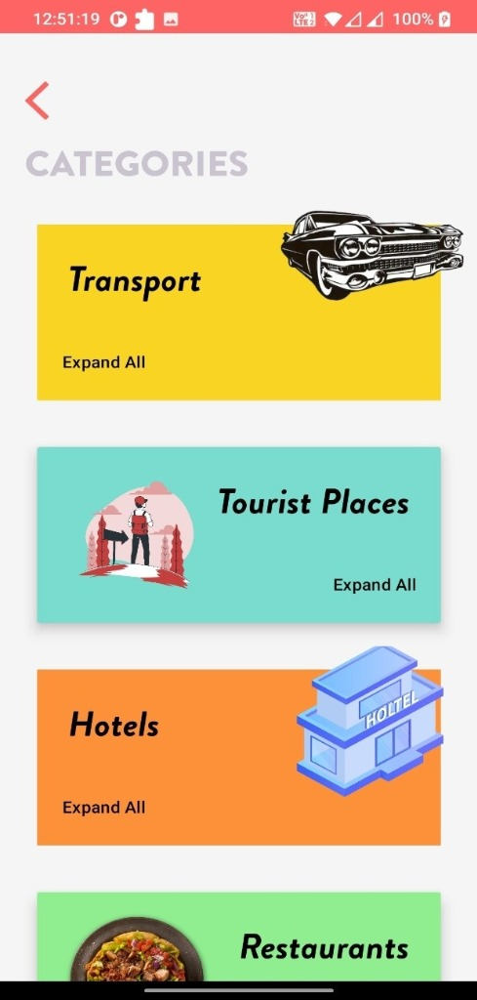
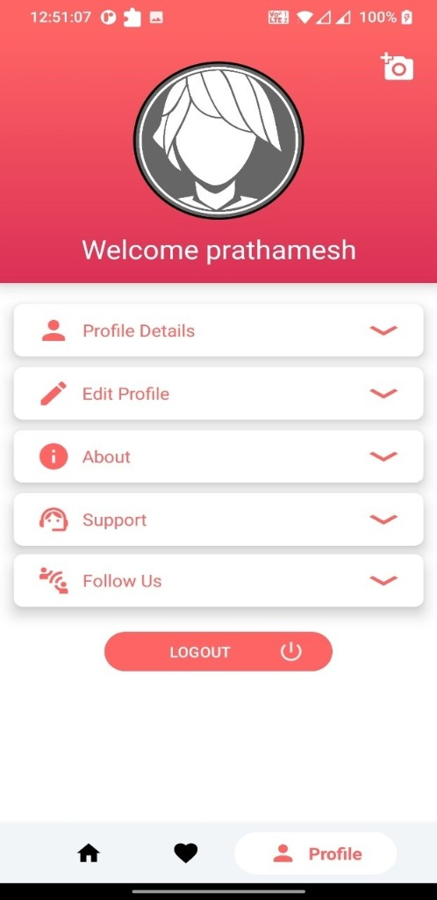

# 🏙️ Nashik City Guide

<p align="center">
  
  
  
  
  
</p>

<p align="center">
  <strong>A comprehensive Android travel &amp; city companion for Nashik, Maharashtra, India.</strong><br/>
  Discover restaurants, hotels, tourist spots, transport hubs, and emergency services — all in one beautifully crafted app.
</p>

---

## 📸 App Preview

<p align="center">
  <em>Here's a glimpse of the Nashik City Guide experience</em>
</p>

<table align="center">
  <tr>
    <td align="center"><strong>🚀 Splash Screen</strong></td>
    <td align="center"><strong>🏠 Home / Dashboard</strong></td>
  </tr>
  <tr>
    <td align="center">
      
    </td>
    <td align="center">
      
    </td>
  </tr>
  <tr>
    <td align="center"><em>Animated welcome with<br/>colorful branding</em></td>
    <td align="center"><em>Personalised greeting, weather,<br/>and quick-access categories</em></td>
  </tr>
</table>

<br/>

<table align="center">
  <tr>
    <td align="center"><strong>📂 Categories</strong></td>
    <td align="center"><strong>👤 Profile</strong></td>
  </tr>
  <tr>
    <td align="center">
      
    </td>
    <td align="center">
      
    </td>
  </tr>
  <tr>
    <td align="center"><em>Browse Transport, Tourist Places,<br/>Hotels, Restaurants &amp; more</em></td>
    <td align="center"><em>Manage profile details,<br/>edit info &amp; app settings</em></td>
  </tr>
</table>

---

## ✨ Features

### 🗺️ Discovery
- **Restaurants** — Browse a curated list of Nashik's best eateries with details, images, and favouriting
- **Hotels** — Find and explore hotels with photo galleries and contact info
- **Tourist Places** — Discover iconic landmarks and hidden gems with image slideshows
- **All Categories View** — Unified browsing across all place types

### 🚌 Transport
- **Railway Station** — Train schedule and station info
- **Bus Terminal** — MSRTC and local bus information
- **Airport / Flights** — Nashik Airport connectivity details

### 🚨 Emergency Services
- **Police Stations** — Nearest stations with contact numbers
- **Hospitals / Ambulance** — Quick access to emergency medical contacts
- **Fire Brigade** — Local fire station directory

### 👤 User Account
- **Secure Sign-Up / Sign-In** — Firebase Authentication (Email &amp; Password + Google Sign-In)
- **Phone OTP Verification** — Firebase Phone Auth during registration
- **BCrypt Password Hashing** — Passwords are hashed client-side before storage using industry-standard BCrypt (work factor 12)
- **Profile Management** — View and edit username, email, DOB, gender, mobile
- **Profile Photo** — Pick from gallery; stored as Base64 in Firebase Realtime Database
- **Password Recovery** — Firebase email-based password reset
- **Change Password** — Re-authentication required before update

### ❤️ Favourites
- Mark restaurants, hotels, and tourist places as favourites
- Persistent across sessions (stored in Firebase Realtime Database per-user)

### 🎨 UX Highlights
- Animated **Splash Screen** with Lottie
- **Shimmer loading effects** while data fetches
- **Image Slideshows** on detail pages (ImageSlideshow)
- **Circular profile avatars** (CircleImageView + Glide)
- Time-of-day greeting on the home screen
- Double-back-press exit confirmation
- Full **offline/no-internet detection** with a retry dialog

---

## 🛠️ Tech Stack

| Layer | Technology |
|---|---|
| **Language** | Java |
| **Platform** | Android (Min SDK 24 / Target SDK 34) |
| **Build System** | Gradle (Groovy DSL) |
| **Backend / Auth** | Firebase Authentication, Firebase Realtime Database, Firebase Storage |
| **Image Loading** | Glide 4.16, Picasso 2.8 |
| **Security** | jBCrypt 0.4 (BCrypt password hashing) |
| **UI Components** | Material Components, CircleImageView, ImageSlideshow, Shimmer, Lottie, Toasty |
| **Navigation** | Jetpack Navigation Fragment |
| **Networking** | Android Volley |
| **Image Picker** | Dhaval2404 ImagePicker |
| **Animations** | Animatoo, Lottie |
| **OTP Input** | OTPView / PinView |
| **Testing** | JUnit 4, AndroidX Test, Espresso |

---

## 📁 Project Structure

```
CityGuideApp/
└── app/src/main/java/com/example/nashik_cityguide/
    ├── Splash_screen.java               # Entry point; routes auth'd vs guest users
    ├── main_ui.java                     # Host activity with bottom navigation
    ├── PasswordHashingSecurity.java     # BCrypt hash/verify utility
    ├── ReadWriteUserDetails.java        # POJO for Firebase Realtime Database
    ├── ProgressHandler.java             # Dialog-based loading indicator
    ├── DoubleBackPressExitHandler.java  # Double-tap-to-exit logic
    │
    ├── signIn_signUp_Activity/          # Authentication screens
    │   ├── signin_signup.java           # Landing (Sign In / Sign Up chooser)
    │   ├── signin_activity.java         # Email login
    │   └── signup_activity.java         # Registration with OTP + BCrypt
    │
    ├── Fragment_Activity/               # Bottom nav fragments
    │   ├── home_fragment.java           # Home: greeting, weather, category grid
    │   ├── fav_fragment.java            # Favourites tab
    │   └── profile_fragment.java        # User profile with expandable cards
    │
    ├── Restaurant_Activity/             # Restaurant list + detail
    ├── Hotel_Activity/                  # Hotel list + detail
    ├── Place_Activity/                  # Tourist places list + detail
    ├── PlaceFav_Activity/               # Favourite tourist places
    ├── RestFav_Activity/                # Favourite restaurants
    ├── hotelFav_Activity/               # Favourite hotels
    │
    ├── Ambulance_Activity/              # Emergency: ambulance/hospitals
    ├── PoliceStation_Activity/          # Emergency: police stations
    ├── FireBrigade_Activity/            # Emergency: fire brigade
    │
    ├── Bus_Activity/                    # Transport: bus terminal
    ├── Railway_Activity/                # Transport: railway station
    ├── Flight_Activity/                 # Transport: airport
    │
    └── Update_Activity/                 # Profile / email update screens
```

---

## 🚀 Getting Started

### Prerequisites

| Requirement | Version |
|---|---|
| Android Studio | Hedgehog (2023.1.1) or newer |
| JDK | 8+ |
| Gradle | 8.x (wrapper included) |
| Android SDK | API 24 – 34 |
| Firebase Project | Required (see Firebase Setup) |

### 1. Clone the Repository

```bash
git clone https://github.com/parthkokil/CityGuideApp.git
cd CityGuideApp
```

### 2. Firebase Setup

This app requires a Firebase project. Follow these steps:

1. Go to the [Firebase Console](https://console.firebase.google.com/) and create a project (or use an existing one).
2. Add an **Android app** with package name `com.example.nashik_cityguide`.
3. Download `google-services.json` and place it in `CityGuideApp/app/`.
4. Enable the following Firebase services in your project:
   - **Authentication** → Email/Password, Google Sign-In, Phone
   - **Realtime Database** → Start in test mode, then apply security rules
   - **Storage** *(optional)* → For future media uploads

> **⚠️ Important:** The `google-services.json` file is not included in this repository for security reasons. The app will not build without it.

### 3. Build & Run

**Using Android Studio:**
1. Open `CityGuideApp/` in Android Studio
2. Wait for Gradle sync to finish
3. Connect a device or start an emulator (API 24+)
4. Press **Run ▶**

**Using the Command Line:**
```bash
cd CityGuideApp

# Debug APK
./gradlew assembleDebug

# Install directly on connected device
./gradlew installDebug

# Run unit tests
./gradlew test

# Full clean build
./gradlew clean assembleDebug
```

The debug APK will be at:
```
app/build/outputs/apk/debug/app-debug.apk
```

---

## 🧪 Testing

### Unit Tests (JVM — no device required)

The following test classes are located in `app/src/test/`:

| Test Class | Coverage |
|---|---|
| `PasswordHashingSecurityTest` | BCrypt hash generation, format verification, salt uniqueness, round-trip verify |
| `ReadWriteUserDetailsTest` | POJO constructor, field assignment, null safety, instance independence |
| `InputValidationTest` | Indian mobile regex, password length rules, email format regex |

Run all unit tests:
```bash
./gradlew test
```

View HTML test report:
```
app/build/reports/tests/testDebugUnitTest/index.html
```

### Instrumented Tests (device/emulator required)

```bash
./gradlew connectedAndroidTest
```

### Manual Integration Checklist

| Feature | Test Steps |
|---|---|
| **Splash Screen** | Launch app → 4 s splash → auto-navigate based on auth state |
| **Sign Up** | Enter valid details → verify Firebase user + RTDB entry created |
| **Sign In** | Correct credentials → navigate to `main_ui` |
| **Sign In (wrong password)** | Wrong password → error shown |
| **Password Recovery** | Enter registered email → reset email sent |
| **Home Screen** | Greeting changes by time, categories display |
| **Restaurant List** | List loads from Firebase, search works |
| **Hotel List** | Same as restaurants |
| **Favourites** | Add/remove → persists across sessions |
| **Profile** | User details load, expandable sections work |
| **Profile Photo** | Pick image → stored as Base64 in RTDB |
| **Change Password** | Re-authenticate → change → new password works |
| **Network Check** | Disable WiFi → "No internet" dialog appears with retry |
| **Double Back Press** | Two back presses within 2 s → exit confirmation |

---

## 🔒 Security Notes

- Passwords are **hashed client-side with BCrypt** (work factor 12) before being written to Firebase Realtime Database. Plain-text passwords are never stored.
- Firebase Authentication is used as the primary identity provider, with BCrypt as a secondary storage layer.
- Network permissions (`INTERNET`, `ACCESS_NETWORK_STATE`) are the only permissions required.
- Profile images are stored as Base64-encoded strings in RTDB; consider migrating to Firebase Storage for large datasets.

---

## 🤝 Contributing

1. Fork the repository
2. Create a feature branch: `git checkout -b feature/my-feature`
3. Commit your changes: `git commit -m "feat: add my feature"`
4. Push to the branch: `git push origin feature/my-feature`
5. Open a Pull Request

Please follow [Conventional Commits](https://www.conventionalcommits.org/) for commit messages.

---

## 📄 License

This project is licensed under the **MIT License** — see the [LICENSE](LICENSE) file for details.

---

## 👨‍💻 Author

**Parth** — Nashik City Guide Android App

> Built with ❤️ for the city of Nashik, Maharashtra, India.
